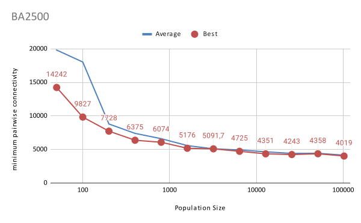
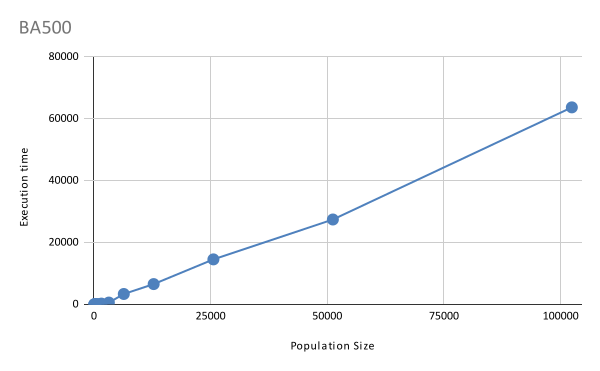
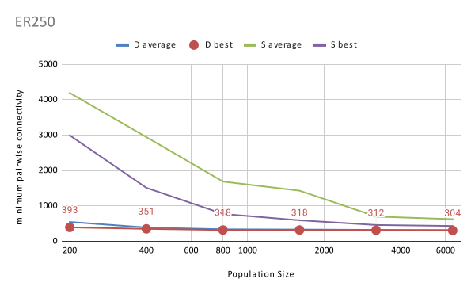
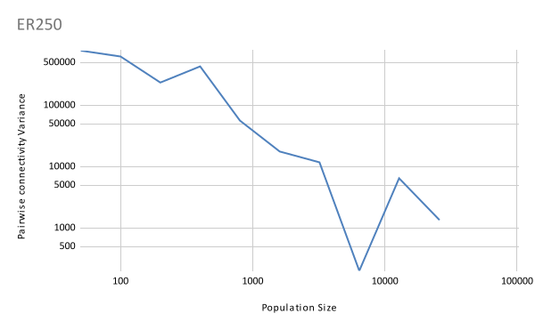
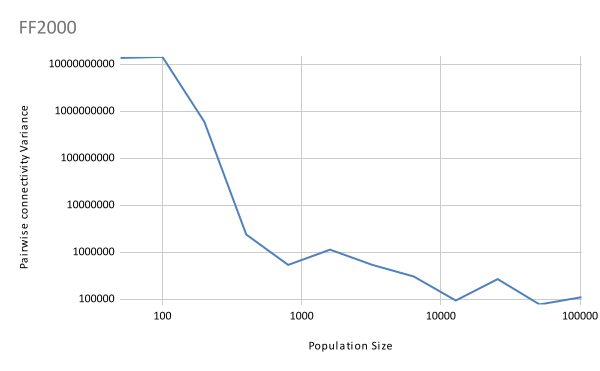

This folder contains results of running the algorithms on the dataset proposed by Mario Ventresca. The conducted experiments are described in more details in the thesis.

# Results

## 1. The Effect of Population Size and the Topology

### 1.1 PSO with the Star Topology

#### 1.1.1 Pairwise Connectivity

##### Barabási-Albert (BA) Graphs

_Figure 1: Average and best pairwise connectivity of PSO with the Star Topology on the BA500 dataset as a function of the population size._

_Figure 2: Average and best pairwise connectivity of PSO with the Star Topology on the BA1000 dataset as a function of the population size._

_Figure 3: Average and best pairwise connectivity of PSO with the Star Topology on the BA2500 dataset as a function of the population size._

_Figure 4: Average and best pairwise connectivity of PSO with the Star Topology on the BA5000 dataset as a function of the population size._

##### Erdős-Rényi (ER) Graphs

_Figure 5: Average and best pairwise connectivity of PSO with the Star Topology on the ER250 dataset as a function of the population size._

_Figure 6: Average and best pairwise connectivity of PSO with the Star Topology on the ER500 dataset as a function of the population size._

_Figure 7: Average and best pairwise connectivity of PSO with the Star Topology on the ER1000 dataset as a function of the population size._

_Figure 8: Average and best pairwise connectivity of PSO with the Star Topology on the ER2500 dataset as a function of the population size._

##### Fire Forest (FF) Graphs

_Figure 9: Average and best pairwise connectivity of PSO with the Star Topology on the FF250 dataset as a function of the population size._

_Figure 10: Average and best pairwise connectivity of PSO with the Star Topology on the FF500 dataset as a function of the population size._

_Figure 11: Average and best pairwise connectivity of PSO with the Star Topology on the FF1000 dataset as a function of the population size._

_Figure 12: Average and best pairwise connectivity of PSO with the Star Topology on the FF2000 dataset as a function of the population size._

##### Watts-Strogatz (WS) Graphs

_Figure 13: Average and best pairwise connectivity of PSO with the Star Topology on the WS250 dataset as a function of the population size._

_Figure 14: Average and best pairwise connectivity of PSO with the Star Topology on the WS500 dataset as a function of the population size._

_Figure 15: Average and best pairwise connectivity of PSO with the Star Topology on the WS1000 dataset as a function of the population size._

_Figure 16: Average and best pairwise connectivity of PSO with the Star Topology on the WS1500 dataset as a function of the population size._

#### 1.1.2 Execution Time

##### Barabási-Albert (BA) Graphs

_Figure 17: Execution time of PSO with the Star Topology on the BA500 dataset as a function of the population size._

_Figure 18: Execution time of PSO with the Star Topology on the BA1000 dataset as a function of the population size._

_Figure 19: Execution time of PSO with the Star Topology on the BA2500 dataset as a function of the population size._

_Figure 20: Execution time of PSO with the Star Topology on the BA5000 dataset as a function of the population size._

##### Erdős-Rényi (ER) Graphs

_Figure 21: Execution time of PSO with the Star Topology on the ER250 dataset as a function of the population size._

_Figure 22: Execution time of PSO with the Star Topology on the ER500 dataset as a function of the population size._

_Figure 23: Execution time of PSO with the Star Topology on the ER1000 dataset as a function of the population size._

_Figure 24: Execution time of PSO with the Star Topology on the ER2500 dataset as a function of the population size._

##### Fire Forest (FF) Graphs

_Figure 25: Execution time of PSO with the Star Topology on the FF250 dataset as a function of the population size._

_Figure 26: Execution time of PSO with the Star Topology on the FF500 dataset as a function of the population size._

_Figure 27: Execution time of PSO with the Star Topology on the FF1000 dataset as a function of the population size._

_Figure 28: Execution time of PSO with the Star Topology on the FF2000 dataset as a function of the population size._

##### Watts-Strogatz (WS) Graphs

_Figure 29: Execution time of PSO with the Star Topology on the WS250 dataset as a function of the population size._

_Figure 30: Execution time of PSO with the Star Topology on the WS500 dataset as a function of the population size._

_Figure 31: Execution time of PSO with the Star Topology on the WS1000 dataset as a function of the population size._

_Figure 32: Execution time of PSO with the Star Topology on the WS1500 dataset as a function of the population size._

### 1.2 PSO with the Dynamic Topology

#### 1.2.1 Pairwise Connectivity

##### Barabási-Albert (BA) Graphs

_Figure 33: Average and best pairwise connectivity of PSO with the Dynamic Topology on the BA500 dataset as a function of the population size._

_Figure 34: Average and best pairwise connectivity of PSO with the Dynamic Topology on the BA1000 dataset as a function of the population size._

_Figure 35: Average and best pairwise connectivity of PSO with the Dynamic Topology on the BA2500 dataset as a function of the population size._

_Figure 36: Average and best pairwise connectivity of PSO with the Dynamic Topology on the BA5000 dataset as a function of the population size._

##### Erdős-Rényi (ER) Graphs

_Figure 37: Average and best pairwise connectivity of PSO with the Dynamic Topology on the ER250 dataset as a function of the population size._

_Figure 38: Average and best pairwise connectivity of PSO with the Dynamic Topology on the ER500 dataset as a function of the population size._

_Figure 39: Average and best pairwise connectivity of PSO with the Dynamic Topology on the ER1000 dataset as a function of the population size._

_Figure 40: Average and best pairwise connectivity of PSO with the Dynamic Topology on the ER2500 dataset as a function of the population size._

##### Fire Forest (FF) Graphs

_Figure 41: Average and best pairwise connectivity of PSO with the Dynamic Topology on the FF250 dataset as a function of the population size._

_Figure 42: Average and best pairwise connectivity of PSO with the Dynamic Topology on the FF500 dataset as a function of the population size._

_Figure 43: Average and best pairwise connectivity of PSO with the Dynamic Topology on the FF1000 dataset as a function of the population size._

_Figure 44: Average and best pairwise connectivity of PSO with the Dynamic Topology on the FF2000 dataset as a function of the population size._

##### Watts-Strogatz (WS) Graphs

_Figure 45: Average and best pairwise connectivity of PSO with the Dynamic Topology on the WS250 dataset as a function of the population size._

_Figure 46: Average and best pairwise connectivity of PSO with the Dynamic Topology on the WS500 dataset as a function of the population size._

_Figure 47: Average and best pairwise connectivity of PSO with the Dynamic Topology on the WS1000 dataset as a function of the population size._

_Figure 48: Average and best pairwise connectivity of PSO with the Dynamic Topology on the WS1500 dataset as a function of the population size._

#### 1.2.2 Execution Time

##### Barabási-Albert (BA) Graphs

_Figure 49: Execution time of PSO with the Dynamic Topology on the BA500 dataset as a function of the population size._

_Figure 50: Execution time of PSO with the Dynamic Topology on the BA1000 dataset as a function of the population size._

_Figure 51: Execution time of PSO with the Dynamic Topology on the BA2500 dataset as a function of the population size._

_Figure 52: Execution time of PSO with the Dynamic Topology on the BA5000 dataset as a function of the population size._

##### Erdős-Rényi (ER) Graphs

_Figure 53: Execution time of PSO with the Dynamic Topology on the ER250 dataset as a function of the population size._

_Figure 54: Execution time of PSO with the Dynamic Topology on the ER500 dataset as a function of the population size._

_Figure 55: Execution time of PSO with the Dynamic Topology on the ER1000 dataset as a function of the population size._

_Figure 56: Execution time of PSO with the Dynamic Topology on the ER2500 dataset as a function of the population size._

##### Fire Forest (FF) Graphs

_Figure 57: Execution time of PSO with the Dynamic Topology on the FF250 dataset as a function of the population size._

_Figure 58: Execution time of PSO with the Dynamic Topology on the FF500 dataset as a function of the population size._

_Figure 59: Execution time of PSO with the Dynamic Topology on the FF1000 dataset as a function of the population size._

_Figure 60: Execution time of PSO with the Dynamic Topology on the FF2000 dataset as a function of the population size._

##### Watts-Strogatz (WS) Graphs

_Figure 61: Execution time of PSO with the Dynamic Topology on the WS250 dataset as a function of the population size._

_Figure 62: Execution time of PSO with the Dynamic Topology on the WS500 dataset as a function of the population size._

_Figure 63: Execution time of PSO with the Dynamic Topology on the WS1000 dataset as a function of the population size._

_Figure 64: Execution time of PSO with the Dynamic Topology on the WS1500 dataset as a function of the population size._

## 2. Comparison with Greedy and VNS algorithms

### 2.1 Execution Time

#### 2.1.1 Barabási-Albert (BA) Graphs

_Figure 65: Execution time of PSO with the Star Topology, PSO with the Dynamic Topology, Greedy, and VNS on the BA dataset as a function of the population size._

#### 2.1.2 Erdős-Rényi (ER) Graphs

_Figure 66: Execution time of PSO with the Star Topology, PSO with the Dynamic Topology, Greedy, and VNS on the ER dataset as a function of the population size._

#### 2.1.3 Fire Forest (FF) Graphs

_Figure 67: Execution time of PSO with the Star Topology, PSO with the Dynamic Topology, Greedy, and VNS on the FF dataset as a function of the population size._

#### 2.1.4 Watts-Strogatz (WS) Graphs

_Figure 68: Execution time of PSO with the Star Topology, PSO with the Dynamic Topology, Greedy, and VNS on the WS dataset as a function of the population size._

## 3. Reliability analysis

### 3.1 Variation of PSO with the Star Topology

#### 3.1.1 Barabási-Albert (BA) Graphs

_Figure 69: variance of PSO with the Star Topology on the BA500 dataset as a function of the population size._

_Figure 70: variance of PSO with the Star Topology on the BA1000 dataset as a function of the population size._

_Figure 71: variance of PSO with the Star Topology on the BA2500 dataset as a function of the population size._

_Figure 72: variance of PSO with the Star Topology on the BA5000 dataset as a function of the population size._

#### 3.1.2 Erdős-Rényi (ER) Graphs

_Figure 73: variance of PSO with the Star Topology on the ER250 dataset as a function of the population size._

_Figure 74: variance of PSO with the Star Topology on the ER500 dataset as a function of the population size._

_Figure 75: variance of PSO with the Star Topology on the ER1000 dataset as a function of the population size._

_Figure 76: variance of PSO with the Star Topology on the ER2500 dataset as a function of the population size._

#### 3.1.3 Fire Forest (FF) Graphs

_Figure 77: variance of PSO with the Star Topology on the FF250 dataset as a function of the population size._

_Figure 78: variance of PSO with the Star Topology on the FF500 dataset as a function of the population size._

_Figure 79: variance of PSO with the Star Topology on the FF1000 dataset as a function of the population size._

_Figure 80: variance of PSO with the Star Topology on the FF2000 dataset as a function of the population size._

#### 3.1.4 Watts-Strogatz (WS) Graphs

_Figure 81: variance of PSO with the Star Topology on the WS250 dataset as a function of the population size._

_Figure 82: variance of PSO with the Star Topology on the WS500 dataset as a function of the population size._

_Figure 83: variance of PSO with the Star Topology on the WS1000 dataset as a function of the population size._

_Figure 84: variance of PSO with the Star Topology on the WS1500 dataset as a function of the population size._

### 3.2 Variation of PSO with the Dynamic Topology

#### 3.2.1 Barabási-Albert (BA) Graphs

_Figure 85: variance of PSO with the Dynamic Topology on the BA500 dataset as a function of the population size._

_Figure 86: variance of PSO with the Dynamic Topology on the BA1000 dataset as a function of the population size._

_Figure 87: variance of PSO with the Dynamic Topology on the BA2500 dataset as a function of the population size._

_Figure 88: variance of PSO with the Dynamic Topology on the BA5000 dataset as a function of the population size._

#### 3.2.2 Erdős-Rényi (ER) Graphs

_Figure 89: variance of PSO with the Dynamic Topology on the ER250 dataset as a function of the population size._

_Figure 90: variance of PSO with the Dynamic Topology on the ER500 dataset as a function of the population size._

_Figure 91: variance of PSO with the Dynamic Topology on the ER1000 dataset as a function of the population size._

_Figure 92: variance of PSO with the Dynamic Topology on the ER2500 dataset as a function of the population size._

#### 3.2.3 Fire Forest (FF) Graphs

_Figure 93: variance of PSO with the Dynamic Topology on the FF250 dataset as a function of the population size._

_Figure 94: variance of PSO with the Dynamic Topology on the FF500 dataset as a function of the population size._

_Figure 95: variance of PSO with the Dynamic Topology on the FF1000 dataset as a function of the population size._

_Figure 96: variance of PSO with the Dynamic Topology on the FF2000 dataset as a function of the population size._

#### 3.2.4 Watts-Strogatz (WS) Graphs

_Figure 97: variance of PSO with the Dynamic Topology on the WS250 dataset as a function of the population size._

_Figure 98: variance of PSO with the Dynamic Topology on the WS500 dataset as a function of the population size._

_Figure 99: variance of PSO with the Dynamic Topology on the WS1000 dataset as a function of the population size._

_Figure 100: variance of PSO with the Dynamic Topology on the WS1500 dataset as a function of the population size._
